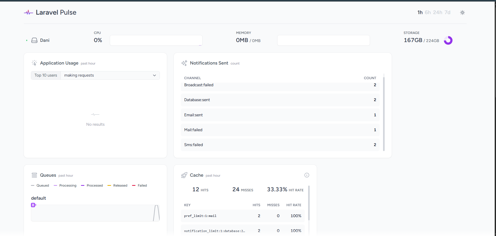

# Laravel Notification Center Service

[](LICENSE.md)
[](https://github.com/malikad778/notification-center/actions)
[](https://php.net)

**Laravel Notification Center** is a high-performance, enterprise-grade notification microservice built with **Laravel 12** and **PHP 8.4**. It provides a scalable, multi-channel architecture for dispatching real-time notifications via Email, SMS, Push, Slack, and WhatsApp.



---

## What is it?
The Notification Center acts as a centralized brain for outbound application messaging. It abstracts away the heavy lifting of determining *where*, *when*, and *how* a user should receive a message across varying platforms. 

Using PHP 8.4 `readonly` Data Transfer Objects (DTOs) and a powerful provider-driven feature mapping system, the core package operates completely agnostic to your application's user schema, relying on modern `Notifiable` contracts.

## Why use this package?

Building reliable notification architectures at scale is complex. This package solves the most daunting enterprise communication challenges out-of-the-box:

- 🏎️ **Parallel Dispatching**: Leverages Laravel 12's native `Concurrency::run()` to fire simultaneous API requests to external providers (Twilio, Resend, WhatsApp) rather than blocking the execution thread sequentially.
- 🚦 **Smart Routing (Laravel Pennant)**: Prevents notification spam by utilizing Feature Flags. Instantly toggle broad channels (e.g. restrict `receive-whatsapp` to `premium` plan members only) directly from memory without bloated `if/else` checks.
- 🔕 **Opt-Outs & Quiet Hours**: Fully customizable User Preferences architecture. Users can selectively disable channels or define per-channel "Quiet Hours" (e.g. "Do not send SMS between 10 PM and 6 AM").
- 🪂 **Automatic Fallback Resolution**: If a primary channel fails (like a Push Notification to an offline device), the system gracefully intercepts the failure and falls back to a secondary channel (like Email). 
- 📊 **Real-time Telemetry (Laravel Pulse)**: Comes packed with custom Pulse Cards (`NotificationThroughputCard`, `FailedNotificationsCard`) hooked natively into the dispatcher lifecycle to monitor platform stability.
- ⚖️ **Rate Limiting & Grouping**: Built-in throttles to strictly govern the volume of outgoing requests per user per channel, alongside payload grouping algorithms to compact duplicated alerts.

---

## 🛠 Usage

### 1. Fluent Facade API
We provide a highly expressive, builder-pattern API via the `NotificationCenter` Facade to streamline dispatching messages manually or within your system controllers.

```php
use malikad778\NotificationCenter\Facades\NotificationCenter;
use malikad778\NotificationCenter\DTOs\NotificationPayload;
use malikad778\NotificationCenter\Enums\NotificationPriority;

$payload = new NotificationPayload(
    title: 'Critical Security Alert',
    body: 'A new login was detected from a new device.',
    actionUrl: 'https://your-app.com/security/sessions'
);

// 1. Basic Smart Dispatch 
// Automatically calculates the optimal allowed channels via Pennant & User Preferences
NotificationCenter::send(to: $user, notification: $payload)
    ->withPriority(NotificationPriority::Urgent) // Bypasses User Quiet Hours
    ->dispatch();

// 2. Strict Channel Overrides
// Ignore smart-routing and force the message through specific protocols
NotificationCenter::send(to: $user, notification: $payload)
    ->via(['sms', 'push'])
    ->dispatch();
```

### 2. Bulk Broadcasting
For massive user-base marketing or service alerts, the built-in Bulk Dispatcher safely queues operations onto Laravel's background workers.

```php
$users = App\Models\User::where('plan', 'premium')->get()->all();

// Dispatches asynchronous batch jobs scaling safely to 10k+ users.
NotificationCenter::sendBulk(
    users: $users, 
    payload: $payload, 
    channels: ['email'] // optional restricted channel lock
);
```

### 3. REST APIs
This microservice ships with standard endpoints designed for seamless frontend consumption.

#### Manage User Preferences
Users have total control over their notification flows.
```http
PUT /api/notifications/preferences
Authorization: Bearer <sanctum_token>

{
    "preferences": [
        {
            "channel": "sms",
            "enabled": true,
            "quiet_hours_start": "22:00",
            "quiet_hours_end": "08:00"
        },
        {
            "channel": "push",
            "enabled": false
        }
    ]
}
```

#### Dynamic Templates
Create interpolatable Database notifications on the fly.
```http
POST /api/notifications/templates
Content-Type: application/json

{
    "name": "Order Shipped",
    "content": "Hello {{ name }}, your order #{{ order_id }} is on its way!"
}
```

---

## Installation & Setup

1. **Install Dependencies**
    ```bash
    composer install
    ```
2. **Environment Configuration**
    Ensure a robust Queue driver like Redis or Database is configured, then run:
    ```bash
    php artisan migrate
    ```
3. **Run Analytics Dashboard**
    ```bash
    php artisan pulse:work
    ```
    Visit `/pulse` in your browser to observe live cluster traffic.

## Testing Integrity
All channels, components, and schema integrations guarantee coverage via Pest.
```bash
php artisan test
```

## License
MIT
